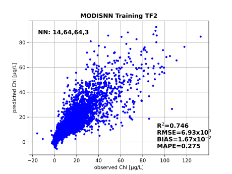

## Intro
this is a branch of the MODISNN to implement the traning/application of nerual network using [`tensorflow`](https://www.tensorflow.org/).
the main repository is using a classic neural network framework, initially implemented in MATALB.

---
## Usage
setup a new `conda` environment including `tensorflow` package.
```
conda create -n tf2 python=3.8
conda actviate tf2
conda install -c conda-forge matplotlib numpy pandas tensorflow=2 gdal netcdf4
```
a [`requirements.txt`](./requirements.txt) included for a tested environment on Windows 10 machine.

---
## Usage
### 1. training MODISNN with TF
use [`MODISNN_TF\MODISNN_TF_training.py`](./MODISNN_TF_training.py)
```
(tf2) $HOME\GitHub\MODISNN\MODISNN_TF>python .\MODISNN_TF_training.py ..\Training\LNA.pkl -T 2 -P -M -N 50 50
...tensorflow system msg ... 
===MODISNN TF training completed; a trained model written to: ..\Training\LNA_NNTF_params_MODIS_rhos_14_50_50_3.h5 ===
===MODISNN plot completed; a result svg written to the input folder: training_tf.svg ===

(tf2) $HOME\GitHub\MODISNN\MODISNN_TF>python .\MODISNN_TF_training.py -h
usage: MODISNN_TF_training.py [-h] [-B] [-N  [...]] [-T] [-M] [-V] [-P] TrainingFile
MODISNN training
positional arguments:
  TrainingFile          the path to the pickle file as the training dataset, example provided: Training/LNA.pkl
optional arguments:
  -h, --help            show this help message and exit
  -B , --NNbands        select # of NN model input bands,only support 14B and 9B, default:14
  -N  [ ...], --nodes  [ ...]
                        hidden layer nodes#, default: 64 64
  -T , --training       the number of repeated training for avg coefficients, default:5
  -M, --model           flag to save trained model, default is False
  -V, --verbose         flag to verbose the training process, default is False
  -P, --plot            flag to plot the training result, default is False
```
the result of above training with [`LNA.pkl`](../Training/LNA.pkl)

---
### 2. apply MODISNN_TF to a sample
```
##-----enter the environment with following commands first----
##conda activate tf2
##cd .\MODISNN\MODISNN_TF
##python
##------------------------------------------------------------
import numpy as np
import tensorflow as tf
from tensorflow import keras
path_net=r'../NNmodels/LNA_NNTF_params_MODIS_rhos_14_64_64_3.h5'
model=keras.models.load_model(path_net)
modis_rhos=[0.0590195,0.05892771,0.06149231,0.06316882,0.07550708,0.08272035,0.08356204,0.05829617,0.05118244,0.04796457,0.03092559,0.02482116,0.02422284,0.01461126]
olci_3bands=model.predict(np.array(modis_rhos).reshape(1,len(modis_rhos)))
print("===output of the MODISNN is: {}===".format(olci_3bands))
```

### 3. apply MODISNN_TF to an image
use [`MODISNN_TF\MODISNN_TF_img.py`](./MODISNN_TF_img.py)
```
(tf2) $HOME\GitHub\MODISNN\MODISNN_TF>python MODISNN_TF_img.py ../TestData/A2011253190500.L2F
...tensorflow system msg ...
===apply MODISNN model:../NNmodels\LNA_NNTF_params_MODIS_rhos_14_50_50_3.h5 ===
===apply MODISNN model:../NNmodels\LNA_NNTF_params_MODIS_rhos_9_64_64_3.h5 ===
===image processed by MODISNN; result write to the input image folder: MODISNN_{inputname} ===

(tf2) $HOME\GitHub\MODISNN\MODISNN_TF>python MODISNN_TF_img.py -h
usage: MODISNN_TF_img.py [-h] [-L] path_L2
MODISNN process image MODIS L2 files generated from l2gen
positional arguments:
  path_L2         the path to the MODIS L2 data after SEADAS `l2gen` processing; this L2 file, in netCDF4 format, needs to include `rhos_xxx` bands example data provided:
                  TestData/A2011253190500.L2F
optional arguments:
  -h, --help      show this help message and exit
  -L , --lakeID   the choice of lakeID for training model selection; files in pattern should exist: NNmodels/NNmodels_[lakeID]_NNTF_params_MODIS_rhos_[14/9]_??_??_3.h5
```