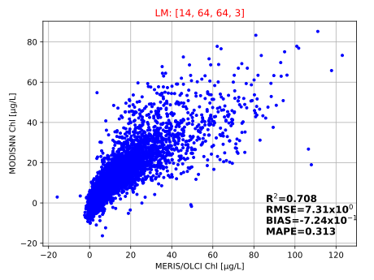

# MODISNN
## About
From MODIS bands, use nueral network(NN) to predict MERIS/OLCI bands for chlorophyll-a concnetration modelling 

This repository is the implementation of the following publication:

- [Zeng,C. and Binding,C. Consistent Multi-Mission Measures of Inland Water Algal Bloom Spatial Extent Using MERIS, MODIS and OLCI. 2021. Remote Sensing 13(17):3349. DOI: 10.3390/rs13173349.](https://www.mdpi.com/2072-4292/13/17/3349)


## Setup
There are a few geospatial python packages are relied to run this program. It is recommended that you use `Anaconda` to build an exclusive python enviornment for MODISNN. here are some suggested steps if you are not familiar with Anaconda:
- install Anaconda, [Installation Guide](https://docs.anaconda.com/anaconda/install/)
- create a conda environment: `conda create -n modisnn python`
- enter the new enviroment: `conda activate modisnn`
- install the required packages: `conda install -c conda-forge matplotlib numpy pandas gdal netcdf4`

---

## Usage
The package can be cloned into a directory with:
`git clone https://github.com/chqzeng/MODISNN`
or you can manually download this repository and unzip to a local directory

within the `modisnn` conda environment or other similar setup, run the MODISNN in one of the following approaches:
### 1. input spectra as a table

use [`MODISNN_spectra_csv.py`](./MODISNN_spectra_csv.py):
```
>>>python MODISNN_spectra_csv.py './TestData/MODIS_rhos_samples.csv' -L 'LErie'

>>>python MODISNN_spectra_csv.py -h
usage: MODISNN_spectra_csv.py [-h] [-L] path_modis_rhos
MODISNN applying to spectra from a csv table
positional arguments:
  path_modis_rhos  the path to csv file of MODIS rhos bands, 14 MODIS bands [412nm to 1240nm] are required. invalid band values as empty, lat/lon columns are optional; start
                   with provided example: ./TestData/MODIS_rhos_samples.csv
options:
  -h, --help       show this help message and exit
  -L , --lakeID    the choice lakeID for training model selection, default: 'LNA' for Lakes of North America 
```

### 2. input spectra inline
use [`MODISNN_spectra_inline.py`](./MODISNN_spectra_inline.py) , replace the spectra and pick a training model:
```
python MODISNN_spectra_inline.py
```

### 3. input spectra as an image
use [`MODISNN_img.py`](./MODISNN_img.py)
```
>>>python MODISNN_img.py TestData/A2011253190500.L2F -L LW
===image processed by MODISNN; result write to the input image folder: MODISNN_{inputname} ===

>>>python MODISNN_img.py -h
usage: MODISNN_img.py [-h] [-L] path_L2
MODISNN process image MODIS L2 files generated from l2gen
positional arguments:
  path_L2         the path to the MODIS L2 data after SEADAS `l2gen` processing; this L2 file, in netCDF4 format, needs to include ρs `rhos_xxx` bands example data provided:
                  TestData/A2011253190500.L2F
options:
  -h, --help      show this help message and exit
  -L , --lakeID   the choice lakeID for training model selection
```

---
## Extra: [Optional]

### How to run the script with ESA `BEAM-DIMAP` files?
[`MODISNN_img_dim.py`](./MODISNN_img_dim.py) processes MODINN for ESA SNAP [BEAM-DIMAP](https://seadas.gsfc.nasa.gov/help-8.1.0/general/overview/BeamDimapFormat.html) format, with [`.dim`+`.data`]. 

run with commandline:
```
##test with an image given in "./TestData" for Lake Winnipeg
>>>python MODISNN_img_dim.py "./TestData/A2011253190500_NN.data" --lakeID "LW"

>>>python .\MODISNN_img_dim.py -h
usage: MODISNN_img_dim.py [-h] [-L lakeID] strDir
MODISNN process image: ESA .dim files
positional arguments:
  strDir                the path to the folder of the MODIS data after SEADAS `l2gen` processing; this folder needs to include `rhos_xxx.img` and `rhos_xxx.hdr` files.
options:
  -h, --help            show this help message and exit
  -L , --lakeID         the choice lakeID for training model selection
```
or use within a python script:
```
import MODISNN_img_dim as moidsnn
modisnn.MODISNN_img_dim("./TestData/A2011253190500_NN.data",lakeID="LW") 
```


### How to prepare MODIS rhos imagery?
- download MODIS L1 imagery from [NASA oceancolor data catalog](https://oceancolor.gsfc.nasa.gov/cgi/browse.pl?sen=amod)
- run the L1 to L2 processing using   [l2gen](https://seadas.gsfc.nasa.gov/help-8.1.0/processors/ProcessL2gen.html), 
  suggesting you use the `SEADAS` software: SeaDAS-OCSSW
	- An example command of `l2gen`:
  `l2gen ifile=./A2011253190500.L1B, geofile=./A2011253190500.GEO, ofile=./A2011253190500.L2F, resolution=1000, l2prod=Rrs_412,Rrs_443,Rrs_469,Rrs_488,Rrs_531,Rrs_547,Rrs_555,Rrs_645,Rrs_667,Rrs_678,Rrs_748,Rrs_859,Rrs_869,Rrs_1240,Rrs_1640,Rrs_2130,rhos_412,rhos_443,rhos_469,rhos_488,rhos_531,rhos_547,rhos_555,rhos_645,rhos_667,rhos_678,rhos_748,rhos_859,rhos_869,rhos_1240,rhos_1640,rhos_2130,flh,chlor_a,Zeu_lee, Zsd_lee, aer_opt=-3, cloud_wave=2130, cloud_thresh=0.04, maskglint=off, maskland=off, maskcloud=off, maskhilt=off, maskstlight=off`

### How to train my own NN models?
If you would like to apply MODISNN to a new lake and requires a finer model than the default `LNA` model of Lakes of North America, you can collect a training dataset and train a new model for a specific lake. MODIS +  MERIS/OLCI data for that lake are BOTH needed as input and output. 
- download MODIS L1 data and run `l2gen` to process toward `ρs` as in the step above
- download OLCI/MERIS L2 data from ESA website
- prepare a list of grid points in your lake of interest; ideally at >5km for any of the two grid points to make sure samples are independant.
- run pixel extraction tools (e.g., [PixEx](https://seadas.gsfc.nasa.gov/help-8.1.0/gpf/GraphProcessingTool.html)) to extract spectra from both MODIS and (MERIS/OLCI) sensors.
- cleanup and join the spectra from the two sensors.  using the script [`Sat_2_Sat_matchup.py`](./Sat_2_Sat_matchup.py).
- train the MODISNN model, using the script [`MODISNN_training.py`](./MODISNN_training.py)
```
>>>python .\MODISNN_training.py Training/LNA.pkl -B 14 -T 15 -M -P -N 64 64
Iteration:  0           Error:  47352.16670898312       scale factor:  3.0
Iteration:  1           Error:  65.41165369868943       scale factor:  0.3
Iteration:  2           Error:  6.093200905484815       scale factor:  0.3
Iteration:  3           Error:  3.300948175016174       scale factor:  0.3
Iteration:  4           Error:  2.9215735852598375      scale factor:  0.3
Iteration:  5           Error:  2.836860392057827       scale factor:  0.3
Iteration:  6           Error:  2.8051699981198466      scale factor:  0.3
Iteration:  7           Error:  2.787749742485841       scale factor:  0.3
Iteration:  8           Error:  2.7755542476818205      scale factor:  0.3
Iteration:  9           Error:  2.7658275984845857      scale factor:  0.3
Iteration:  10          Error:  2.757547235728398       scale factor:  0.3
Iteration:  11          Error:  2.7502610527212106      scale factor:  0.3
Iteration:  12          Error:  2.74373364254917        scale factor:  0.3
Iteration:  13          Error:  2.7378239137088087      scale factor:  0.3
Iteration:  14          Error:  2.7324374348362612      scale factor:  0.3
Iteration:  15          Error:  2.73076121140133        scale factor:  0.03
Maximum number of iterations reached
===MODISNN training completed; a trained model written to: Training\LNA_NN_params_MODIS_rhos_14B_to_MERISL2_3B.csv ===
===MODISNN plot completed; a result svg written to the input folder: training.svg ===

>>>python .\MODISNN_training.py -h
usage: MODISNN_training.py [-h] [-P] [-N] [-B] TrainingFile
MODISNN training
positional arguments:
  TrainingFile       the path to the pickle file as the training dataset, example provided: Training/All_Lakes_Training_NN.pkl
options:
  -h, --help         show this help message and exit
  -P, --plot         flag to plot the training result, default is False
  -N , --Ntraining   the max number of iteration, default:15
  -B , --NNbands     select # of NN model input bands,only support 14B and 9B, default:14
```
- after training, the model will be exported as a `.csv` file. Add 14B/9B NN models to the `./NNModels` folder and choose the model by assigning the `lakeID` in applications

---
the example training result using the given [`LNA.pkl`](./Training/LNA.pkl):

---
to train/apply the MODISNN using [`tensorflow2`](https://www.tensorflow.org/) instead of classic NN, please use ['MODISNN_TF'](./MODISNN_TF)